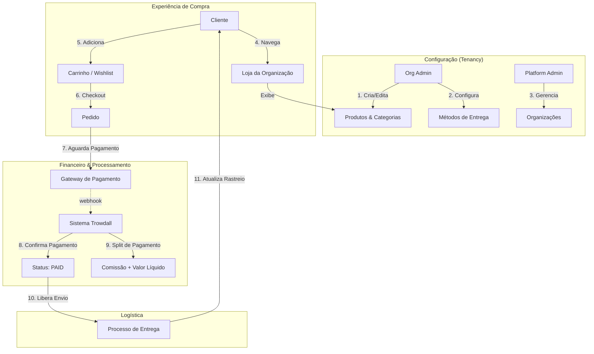

echo "## Atualização do README" >> README.md

It looks like your request is incomplete — you asked “Create an issue in keroldias123/store to ” and stopped. I can create the issue for you, but I need a few details first.

Please confirm or provide the following (you can copy-edit one of the templates below):

Required

Title (one-line summary)
Body / description (what you want done; for bugs include steps to reproduce, expected vs actual, environment)
Optional (tell me which to set)

Labels (e.g., bug, enhancement, docs, help wanted)
Assignees (GitHub usernames)
Milestone or project
Draft? (true/false)
Any files or screenshots to attach (or a URL)
If you want, pick one of these quick templates and edit it:

Bug report Title: Unexpected error when adding item to cart Body:
What happened: Adding item X to cart triggers a 500 error
Steps to reproduce:
Go to /products/123
Click "Add to cart"
Observe 500 response
Expected: Item should be added and cart updated
Environment: production, Chrome 119 on macOS
Feature request Title: Support product variants (size/color) on product page Body:
Goal: Allow customers to choose size and color variants before adding to cart.
Acceptance criteria:
Variant selector appears on product page
Add-to-cart adds selected variant
Variant price updates if different
Docs / chore Title: Add contributor setup guide to README Body:
Add a "Contributing" section with local dev setup, tests, and pre-commit hooks.
Reply with the completed info (or say “Create with template 2 as-is and label = enhancement, assign to @keroldias123”) and I’ll create the issue in keroldias123/store.
### 3. Produtos e Categorias

- Categorias próprias por organização.
- Produtos com: nome, descrição, imagens, preço base, desconto.
- Cada produto pertence a uma categoria e a uma organização.
- Produtos ativos/inativos.
- Sistema de wishlist por cliente.

### 4. Pedidos (Orders)

- Cada pedido pertence a um cliente e a uma organização.
- Pedido contém itens com preço e desconto snapshot.
- Status do pedido: `WAITING_FOR_PAYMENT`, `PAYMENT_CONFIRMED`.
- Histórico de pedidos do cliente e da organização.

### 5. Entregas (Delivery)

- Organizações definem métodos de entrega com preço e tempo estimado.
- Cada pedido possui entrega associada.
- Suporta múltiplos serviços de entrega.

### 6. Pagamentos (Payment)

- Integração com gateways: Stripe, PayPal, MultiCaixa.
- Status: `PENDING`, `PAID`, `FAILED`, `REFUNDED`.
- Calcula automaticamente comissão da plataforma e valor líquido para a organização.
- Snapshot do valor pago, método e percentual da comissão.

### 7. Wishlist

- Clientes podem criar listas de produtos favoritos.
- Relacionamento com produtos multi-organização.

### 8. Notificações

- Suporte a e-mail, SMS, push (via integração futura).
- Templates configuráveis por organização.
- Eventos disparados: pedido pago, pedido cancelado.

### 9. Tokens e Recuperação de Senha

- Sistema de token para recuperação de senha (`PASSWORD_RECOVER`).
- Tokens com data de expiração.

### 10. Auditoria e Histórico

- Controle de alterações de produtos, pedidos e entregas.
- Histórico de pagamentos e status.
- Registro de membros, convites e roles.

### 11. Dashboard / Relatórios (Admin)

- Visualização de pedidos, faturamento e comissões.
- Visualização por organização ou global (PLATFORM_ADMIN).
- Estatísticas de vendas e entregas.

### 12. Segurança e Compliance

- RBAC centralizado e testável.
- Controle de acesso por organização e usuário.
- Validação de entradas via Zod.
- Password hashing e tokens JWT seguros.

### 13. Extensibilidade

- Estrutura modular para adicionar novos serviços ou integrações.
- Preparado para marketplace multi-vendedor futuro.
- Banco de dados relacional com Prisma ORM.

### 14. Tecnologias

- **Backend**: Node.js, TypeScript, Prisma, PostgreSQL/MySQL
- **Frontend**: Next.js (base Rocketseat RBAC) + Tailwind CSS
- **Autenticação**: NextAuth, JWT
- **Mensageria / Eventos**: RabbitMQ ou Kafka (para evolução futura)
- **Validação**: Zod
- **Controle de versão**: Git, monorepo opcional

---

## Fluxo da Aplicação



---

## Estrutura Recomendada

```text
src/
 ├─ auth/            # autenticação, RBAC
 ├─ organizations/   # gestão de organizações, membros, convites
 ├─ products/        # produtos, categorias
 ├─ orders/          # pedidos e itens
 ├─ delivery/        # métodos e pedidos de entrega
 ├─ payments/        # pagamentos e comissões
 ├─ customers/       # usuários finais, wishlists
 ├─ notifications/   # templates e disparo de eventos
 └─ utils/           # helpers, validações, logger
```

---
gh pr create --base main --head feat/readme-update --title "Update README" --body "Small documentation update"

## Próximos Passos

- Implementar **migrations Prisma**
- Criar **abilities reais** com CASL
- Desenvolver **checkout com cálculo de comissão**
- Integrar gateways de pagamento
- Criar **interface do cliente e dashboard da organização**
- Adicionar notificações reais por e-mail/SMS

---

Este README serve como **documentação completa do projeto Trowdall**, pronto para começar o desenvolvimento com RBAC SaaS multi-empresa e funcionalidades de e-commerce completas.
